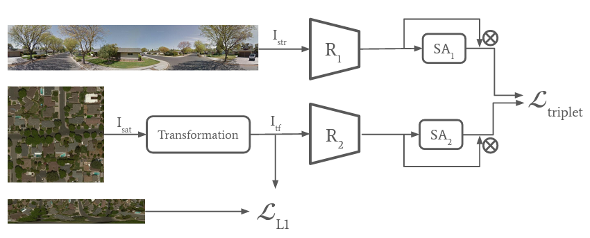

# Realistic-Cross-View-Image-Geo-Localization

## Method
 
Cross-view image-based geo-localization aims to determine the location of a given street view image by matching it against a collection of geo-tagged satellite images. Recent works ([Shi et al., 2019](https://proceedings.neurips.cc/paper/2019/file/ba2f0015122a5955f8b3a50240fb91b2-Paper.pdf); [Toker et al., 2021](https://openaccess.thecvf.com/content/CVPR2021/papers/Toker_Coming_Down_to_Earth_Satellite-to-Street_View_Synthesis_for_Geo-Localization_CVPR_2021_paper.pdf), [Shi et al., 2020](https://openaccess.thecvf.com/content_CVPR_2020/papers/Shi_Where_Am_I_Looking_At_Joint_Location_and_Orientation_Estimation_CVPR_2020_paper.pdf)) rely on the polar coordinate transformation to bring the two particular image domains closer to each other. This comes with the assumption of an existing reference satellite image exactly centered at the location of the query street view image. We rule out this assumption and replace the polar transformation with a trainable [Spatial Transformer Network (STN)](https://proceedings.neurips.cc/paper/2015/file/33ceb07bf4eeb3da587e268d663aba1a-Paper.pdf). Our models challenge the state of the art. Furthermore, our experiments show that, with the appropriate parameter setting, the STN using [thin plate spline transformation](https://ieeexplore.ieee.org/document/24792) is a viable choice for this task.

Our model architecture is based on [Shi et al., 2019](https://proceedings.neurips.cc/paper/2019/file/ba2f0015122a5955f8b3a50240fb91b2-Paper.pdf) and [Toker et al., 2021](https://openaccess.thecvf.com/content/CVPR2021/papers/Toker_Coming_Down_to_Earth_Satellite-to-Street_View_Synthesis_for_Geo-Localization_CVPR_2021_paper.pdf). We include a transformation block after the input satellite image, where either polar coordinate transformation or a spatial transformation network could be activated. The spatial transformer network can be either initialized with an affine transformation, with a composed affine transformation or with a thin plate spline transformation (based on this [pytorch implemenation](https://github.com/WarBean/tps_stn_pytorch)). Note that the L1 loss is enforced only on the output of the spatial transformer network to guide its learned transformation into the direction of the polar transformation.

## Usage

### Datasets and Polar transformation

* In our experiments, we use the <a href="https://github.com/viibridges/crossnet">CVUSA</a> and <a href="https://github.com/Jeff-Zilence/VIGOR">VIGOR</a> datasets.
* Change dataset paths under `helper/parser.py`. 
* The polar transformation script is based on [this source](https://github.com/shiyujiao/cross_view_localization_SAFA/blob/master/script/data_preparation.py), you can find it `/data/convert_polar.py`.

### Train 
* For CVUSA, use [`train_cvusa.py`], and see options under [`utils/parser.py`](https://github.com/Notram1/Realistic-Cross-View-Image-Geo-Localization/blob/readme/utils/parser.py). 
* For VIGOR, use `train_vigor.py`, and see options under [`utils/parser.py`](https://github.com/Notram1/Realistic-Cross-View-Image-Geo-Localization/blob/readme/utils/parser.py).

### Test 
To test our architecture on CVUSA run  `test_cvusa.py`.

The code has been implemented & tested with Python 3.7.12 and Pytorch 1.10.0.
